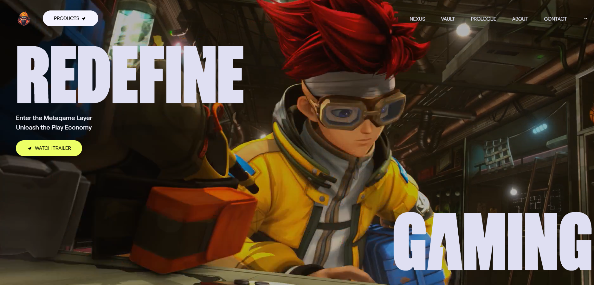

# 🌐 Awwwards-Inspired Website  

A visually captivating website built with **React.js, Tailwind CSS, and GSAP**, featuring scroll-triggered animations, smooth video transitions, and a luxurious, modern UI/UX.  
Inspired by [Zentry](https://zentry.com) and built step by step by following [JavaScript Mastery’s tutorial](https://www.youtube.com/watch?v=zA9r5zTllx4).  

---

## 📋 Table of Contents
- [Introduction](#-introduction)  
- [Tech Stack](#-tech-stack)  
- [Features](#-features)  
- [Setup](#-setup)  
- [Usage](#-usage)  
- [Project Structure](#-project-structure)  
- [Assets](#-assets)  
- [Disclaimer](#-disclaimer)  

---

## 🤖 Introduction
This project recreates an **Awwwards-winning style website**, packed with engaging animations and immersive storytelling.  
It’s designed to help developers learn **GSAP animations**, **React component architecture**, and **responsive design** techniques.

---

## ⚙️ Tech Stack
- ⚡ **React.js** – Component-based UI  
- 🎨 **Tailwind CSS** – Utility-first styling  
- 🎞 **GSAP (GreenSock Animation Platform)** – Smooth animations & scroll effects  

---

## 🔋 Features
- 🎥 **Video Transitions** – Seamlessly integrated videos for storytelling  
- 📜 **Scroll-Based Animations** – Trigger animations while scrolling  
- 🔷 **Clip-Path Transitions** – Unique geometric transitions with CSS  
- 🌀 **3D Hover Effects** – Interactive hover animations  
- 📱 **Responsive Design** – Works across all screen sizes  
- 🧩 **Reusable Components** – Clean and modular architecture  

---

## 🤸 Setup

### 1. Prerequisites
Make sure you have installed:
- [Node.js](https://nodejs.org/) (v16+)  
- [Git](https://git-scm.com/)  

### 2. Installation
```bash
# Clone the repository
git clone https://github.com/your-username/awwwards-website.git

# Navigate to project folder
cd awwwards-website

# Install dependencies
npm install
